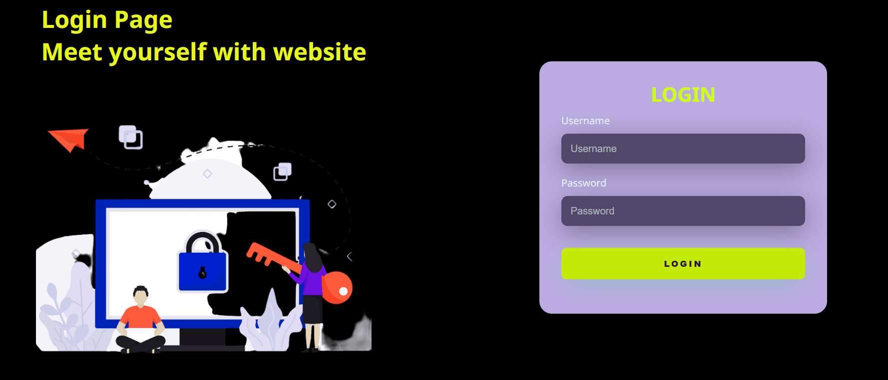
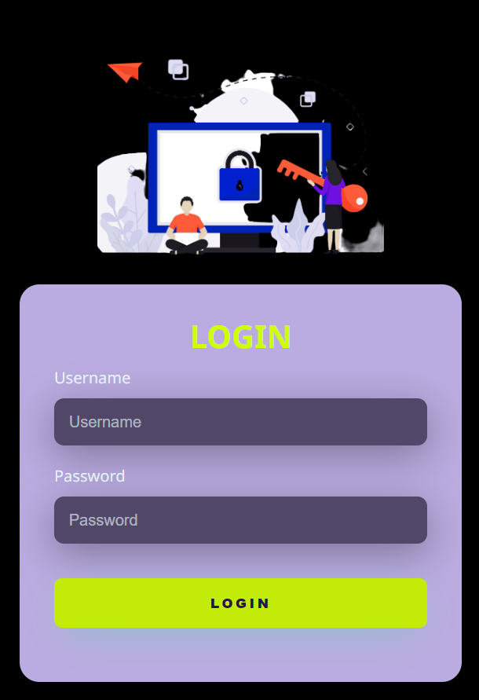

# Login Responsive Page

A responsive login Page using HTML5 and CSS3

## Summary
<!--ts-->
 * [Technologies used](#Technologies-used)
 * [Desktop View](#Desktop-View)
 * [Mobile View](#Mobile-View)
<!--te-->

## Technologies used
<ul>
  <li>HTML5</li>
  <li>CSS3</li>
</ul>
<h2>Desktop View</h2>

  

<h2Mobile View</h2>

  

